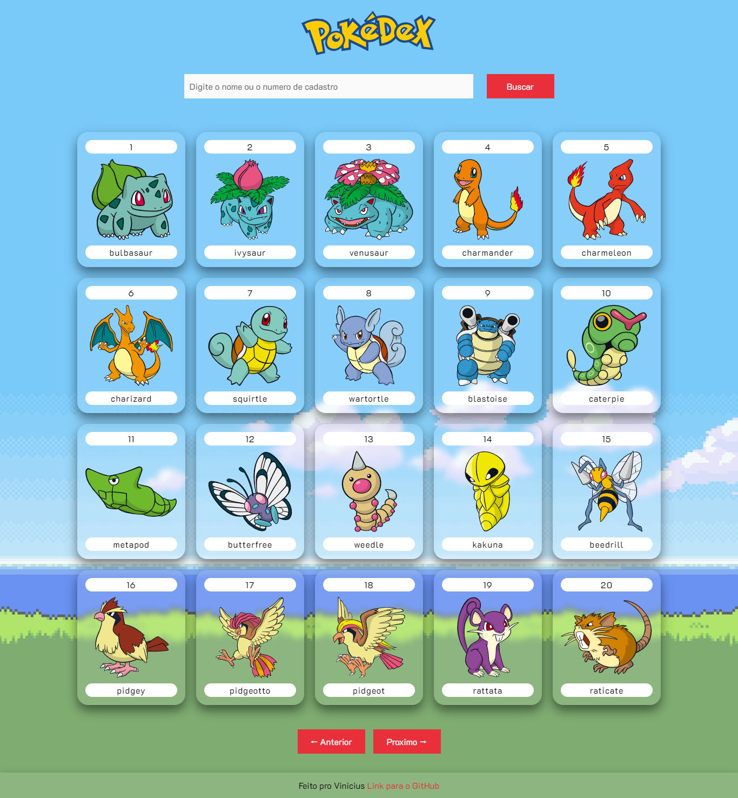
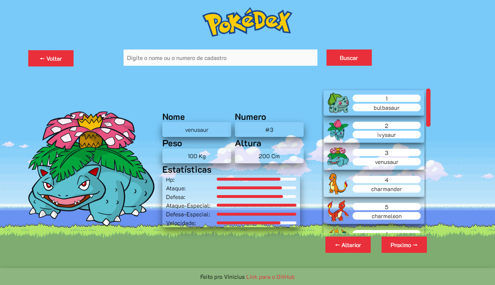

<h1 align="center">PokéDex</h1>

<h2>Tecnologias Utilizadas</h2>
<ul>
  <li>ReactJs</li>
  <li>React-Router-Dom</li>
  <li>Css</li>
  <li>API 
  <a href="https://pokeapi.co/">Pokemon</a></li>
</ul>

<h2>Fonte Utilizada</h2>

'K2D', sans-serif

<h2>Cores Ulitizadas</h2>
<ul>
  <li>Cor de destaque: E92F3A </li>
  <li>Cor do placeholder: 6B6B6B </li>
  <li>
    Cor do texto: 
    <ul>
      <li>000</li>
      <li>fff</li>
    </ul>
   </li>
  <li>Cor do Input: FAFAFA</li>
</ul>

